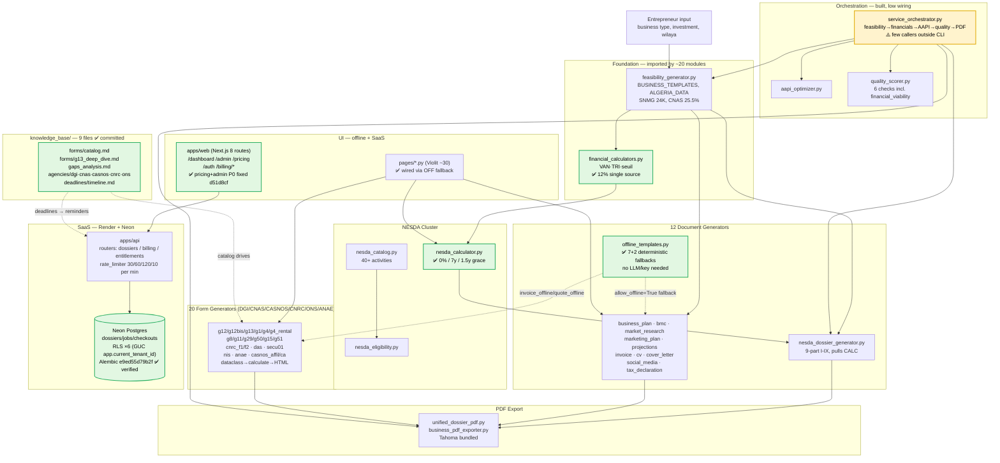

# DSC — Generator Architecture & Automation Map

**Live-audited:** 2026-08-22, via Desktop Commander direct read + `DSC_DEEP_ASSESSMENT.md` 7-lane swarm (commit `d51d8cf`; prior audit 2026-08-20 `f8f5d61`).
**Companion files:** `AGENTS.md` (cross-project protocol), `UPDATES.md` (changelog — read first), `DSC_DEEP_ASSESSMENT.md` (full truth, 466 lines), `SKILL.md` (tool mapping).
**Purpose:** Evidence-backed map of what each generator produces/needs/connects to, and where automation is real vs. aspirational. All rates verified against `verify_rates.py` (38 checks).

---

## 0. Verification: "What Was Just Done" (2026-08-19) — claim vs. live code

| # | Claim (from CLAUDE_DESKTOP_SUMMARY.md) | Status | Evidence |
|---|---|---|---|
| 1 | VAN/TRI unified to single source (12%) | ✅ **Confirmed** | `financial_calculators.py:96` — `FinancialCalculators.van(discount_rate=0.12)`. 6 callers: `feasibility_generator.py`, `nesda_dossier_generator.py`, `projections_engine.py`, `nesda_calculator.py`, `api.py`, `pages/calculators.py`. |
| 2 | G29 salary IRG → 2026 6-tranche barème | ✅ Confirmed | `g29_irg_salaires_generator.py:38` — 20K/40K/80K/160K/320K monthly @ 0/23/27/30/33/35 (corrected 2026-08-22, was 30K/120K/360K/1.6M/3.2M). |
| 3 | G1 revenue IRG → 240K/480K/960K/1.92M/3.84M | ✅ Confirmed | `g1_ggr_generator.py:36` IRG_BAREME 6 tranches (UPDATES.md 2026-08-20). |
| 4 | SNMG 20K → 24K | ✅ Confirmed | `feasibility_generator.py` `ALGERIA_DATA["snmg_monthly"]=24000` (UPDATES.md 2026-08-15). |
| 5 | NESDA 2%/12y → 0%/7y/1.5y | ✅ **Fixed** | `nesda_calculator.py:82-84` defaults `interest_rate=0.0, repayment_years=7, grace_years=1.5`; `nesda_dossier_generator.py::_generate_part6()` pulls from shared calculator. |
| 6 | SKILL.md created | ✅ Confirmed | Exists, synced to 20 forms / 0%/7y/1.5y on 2026-08-20 (see §0b P1). |
| 7 | nesda_phase2_template.md created | ⚠️ **Not in this repo** | Lives in sibling LifeWorkspace KB (`UPDATES.md` 2026-08-19). |
| 8 | Committed + pushed | ✅ Confirmed | HEAD `d51d8cf` on `origin → kamelmh/digital-services-center` (was `f8f5d61` at last audit). Working tree clean after `18335cf` hygiene. |

**Net: 6/8 fully confirmed, 1 external, 1 stale rate now corrected in §0b.**

## 0b. Deep Audit (2026-08-22, `18335cf` → `d51d8cf`) — what the swarm fixed

| # | Fix | Status | Evidence |
|---|---|---|---|
| 1 | ANAE IFU swap — Services 0.12 / Production 0.05 (Art.282sexies) | ✅ | `anae_generator.py` — was swapped; `tests/test_generators.py` ANAE tests corrected |
| 2 | G50 double-deduction — `tva_net = collectee+regs-deductions` once | ✅ | `g50_generator.py` — collapsed double `tva_deductions_total` |
| 3 | G12 min clamp — CA total uses `calc.ifu_total` not raw sum | ✅ | `g12_official.py` |
| 4 | G13 missing key — `total_deductible_expenses` in return dict | ✅ | `g13_bnc_generator.py` — was 0 in HTML |
| 5 | G1 salary — `SalaireData.compute()` subtracts `cotisations_salarié` pre-abattement | ✅ | `g1_ggr_generator.py` |
| 6 | Frontend P0 `pricing` — `"use client"` to line 1 (Next 14) | ✅ | `apps/web/app/pricing/page.tsx:1` — was build-blocking |
| 7 | Frontend P0 `admin` — `API` const + `PdfViewer r2Key→url` | ✅ | `apps/web/app/admin/page.tsx` |
| 8 | CI green | ✅ | `ci.yml` — 132/132 `tests/test_generators.py` + `test_cross_artifact` + 38 rate checks (`python -m pytest tests/ -q --override-ini="addopts="`) |
| 9 | knowledge_base committed | ✅ | 9 files now tracked: `catalog.md`, `g13_deep_dive.md`, `gaps_analysis.md`, `agencies/{dgi,cnas,casnos,cnrc,ons}.md`, `deadlines/timeline.md`, `README.md` |
| 10 | 20 form generators live | ✅ | `g12`, `g12bis`, `g13`, `g1`, `g4`, `g4_rental`, `g8`, `g11`, `g29`, `g50`, `g15`, `g51`, `cnrc_f1/f2`, `das`, `secu01`, `nis`, `anae`, `casnos_affiliation/ca` — each `dataclass→calculate→HTML` + `hook_generation()` |

---

## 1. What actually exists (32 generators + infra, not "19")

| Category | Count | Modules |
|---|---|---|
| Document generators | 12 | feasibility, nesda_dossier, business_plan, bmc, market_research, marketing_plan, financial_projections, invoice, cv, cover_letter, social_media, tax_declaration |
| Form generators (DGI/CNAS/CASNOS/CNRC/ONS/ANAE) | **20** | `g12_official`, `g12_bis`, `g13_bnc`, `g1_ggr`, `g4_ibs`, `g4_rental`, `g8_existence`, `g11_bic`, `g29_irg_salaires`, `g50`, `g15_cessation`, `g51`, `cnrc_f1`, `cnrc_f2`, `das_cnas`, `secu01`, `nis`, `anae`, `casnos_affiliation`, `casnos_ca` |
| NESDA infra | 4 | nesda_catalog (40+ activities), nesda_eligibility, nesda_calculator (0%/7y/1.5y), nesda_dossier_generator (9-part) |
| Financial infra | 2 | financial_calculators (VAN/TRI/seuil — single source `0.12`), projections_engine |
| PDF export | 3 | unified_dossier_pdf, business_pdf_exporter, tax_form_pdf_exporter + `dsc_utils` Tahoma |
| Orchestration & QA | 3 | service_orchestrator, aapi_optimizer, quality_scorer (6 checks incl. financial_viability) |
| Offline lane | 1+ | `offline_templates.py` — 7 deterministic fallbacks + `invoice_offline/quote_offline` (✅ done, `allow_offline=True` default) |
| SaaS | 6 | `apps/api` (dossiers/billing/entitlements + `rate_limiter.py` + Alembic `e9ed55d79b2f` RLS×6), `apps/web` (dashboard/admin/pricing/auth/billing) |
| Supporting | 6 | pricing_calculator, batch_processor, government_paperwork_helper, linkedin_*, training_data_collector |
| Knowledge | 9 | `knowledge_base/` — catalog, gaps_analysis, agencies×5, deadlines, g13_deep_dive |
| UI | ~30+8 | `pages/*.py` (Violit offline) + `apps/web/app/*.tsx` (Next.js 14) |

---

## 2. Dependency graph (live, 2026-08-22)

> **Stale warnings removed (2026-08-22):** `6 pages import phantom modules` — fixed (offline fallback + `api.py` preview parity 20/20, `apps/web` P0s fixed). `offline lane future` — done (`offline_templates.py:399` + invoice offline). All `7 tax forms` refs → 20. NESDA `2%/12y` → `0%/7y/1.5y` everywhere (see `nesda_calculator.py:82-84`).
