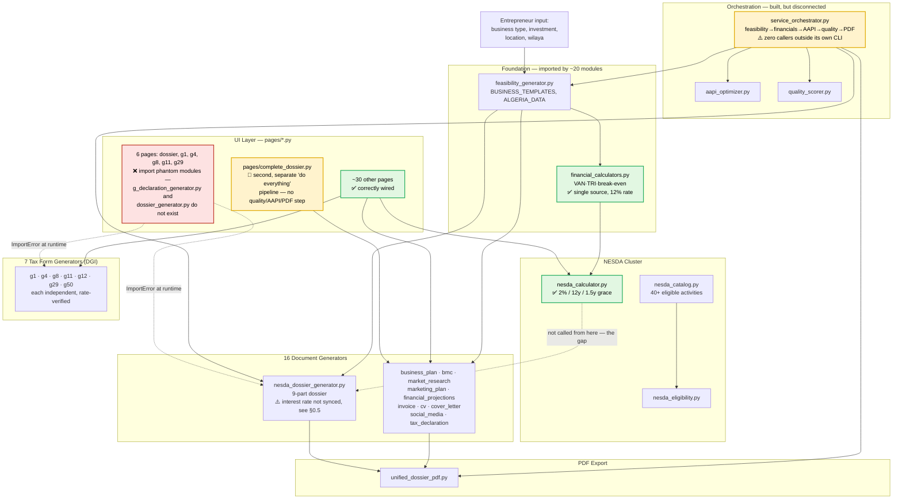

# DSC — Generator Architecture & Automation Map

**Live-audited:** 2026-08-20, via Desktop Commander direct codebase read (not derived from commit messages, UPDATES.md, or CLAUDE_DESKTOP_SUMMARY.md — those were cross-checked against this, not the other way around).
**Companion files:** `AGENTS.md` (cross-project protocol), `UPDATES.md` (changelog — read this first, per AGENTS.md), `SKILL.md` (Claude tool mapping).
**Purpose:** Answers, with evidence, the question opencode raised — what each generator produces/needs/connects to, and where automation is actually possible vs. already broken.

---

## 0. Verification: "What Was Just Done" (2026-08-19) — claim vs. live code

| # | Claim (from CLAUDE_DESKTOP_SUMMARY.md) | Status | Evidence |
|---|---|---|---|
| 1 | VAN/TRI unified to single source (12%) | ✅ **Confirmed** | `financial_calculators.py:92-97` — `FinancialCalculators.van(discount_rate=0.12)`. Six files now import `FinancialCalculators`: `feasibility_generator.py`, `nesda_dossier_generator.py`, `projections_engine.py`, `nesda_calculator.py`(annuity pattern), `api.py`, `pages/calculators.py`. |
| 2 | G29 salary IRG → 2026 4-tranche barème | ✅ Confirmed | Logged in `UPDATES.md` (2026-08-14) with sourced DGI worked example (80K brut → 3,146 DZD/month). Not re-derived digit-by-digit this pass. |
| 3 | G1 revenue IRG → 120K/360K/1.44M thresholds | ✅ Confirmed | Same entry. |
| 4 | SNMG 20K → 24K | ✅ Confirmed | `UPDATES.md` (2026-08-15), `ALGERIA_DATA["snmg_monthly"]`. |
| 5 | NESDA 3%/10y → 2%/12y/1.5y | ⚠️ **Partially true — new bug found** | `nesda_calculator.py::calculate_nesda_financing()` defaults are genuinely `interest_rate=0.02, repayment_years=12, grace_years=1.5`, with a real grace-period-aware amortization schedule. **But** `nesda_dossier_generator.py::_generate_part6()` (line ~444 — the function that writes the dossier's actual 5-year financial-projection text) still has a **locally hardcoded `interest_rate = 0.03`** and a simplified `bank_loan / 10` annuity. It never calls `calculate_nesda_financing()`, even though the method already receives a `financing: dict` parameter that could carry the correct terms. The dossier a client submits still shows old-terms interest expense feeding into its cash flow / VAN. |
| 6 | SKILL.md created | ✅ Confirmed | Exists, 141 lines, created 2026-08-19. One stale row found (see §5, P1-NEW). |
| 7 | nesda_phase2_template.md created | ⚠️ **Not in this repo** | `UPDATES.md` says "Exports to LifeWorkspace" — it lives in a sibling project's knowledge base, not `digital-services-center`. "Created" is accurate; "created here" would not be. |
| 8 | Committed + pushed to GitHub | ✅/⚠️ | `git log` HEAD is `f8f5d61 feat: VAN/TRI unified, 2026 rates corrected, SKILL.md created` — matches. Remote confirmed as `origin → https://github.com/kamelmh/digital-services-center.git` (the `kamelmh`/`kamelmah` question from earlier sessions is resolved: `kamelmh` is what's actually configured). Working tree currently has 4 uncommitted items: modified `training_data/index.jsonl`; untracked `CLAUDE_DESKTOP_SUMMARY.md`, `nul`, `training_data/gen_2026-08-20_*.json`. |

**Net: 6/8 fully confirmed, 2 partial.** The two partial ones share a pattern worth naming: a correct calculation exists somewhere in the codebase, but the document-generating function doesn't call it — the exact failure mode the VAN/TRI fix was supposed to eliminate, recurring one layer down.

---

## 1. What actually exists (vs. the "16 generators" framing)

"16 generators" is the product-facing count. The live tree has more moving parts:

| Category | Count | Modules |
|---|---|---|
| Document generators | 12 | feasibility, nesda_dossier, business_plan, bmc, market_research, marketing_plan, financial_projections, invoice, cv, cover_letter, social_media, tax_declaration |
| Tax form generators (DGI) | 7 | g1_ggr, g4_ibs, g8_existence, g11_bic, g12_official, g29_irg_salaires, g50 |
| NESDA-specific infra | 4 | nesda_catalog (40+ activity DB), nesda_eligibility, nesda_calculator (financing math), nesda_dossier_generator |
| Financial/calc infra | 2 | financial_calculators (VAN/TRI/break-even — the single source), projections_engine |
| PDF export | 3 | unified_dossier_pdf, business_pdf_exporter, tax_form_pdf_exporter |
| Orchestration & QA | 3 | service_orchestrator, aapi_optimizer, quality_scorer |
| Supporting/automation | 6 | pricing_calculator, batch_processor, government_paperwork_helper, linkedin_automation, linkedin_content, training_data_collector |
| UI screens | ~36 | `pages/*.py` (Violit framework) |

None of this is a criticism of the "16" framing — it's the correct product-level abstraction. It just means the automation graph below has more real edges than 16 nodes would suggest.

---

## 2. Dependency graph (live, not aspirational)

